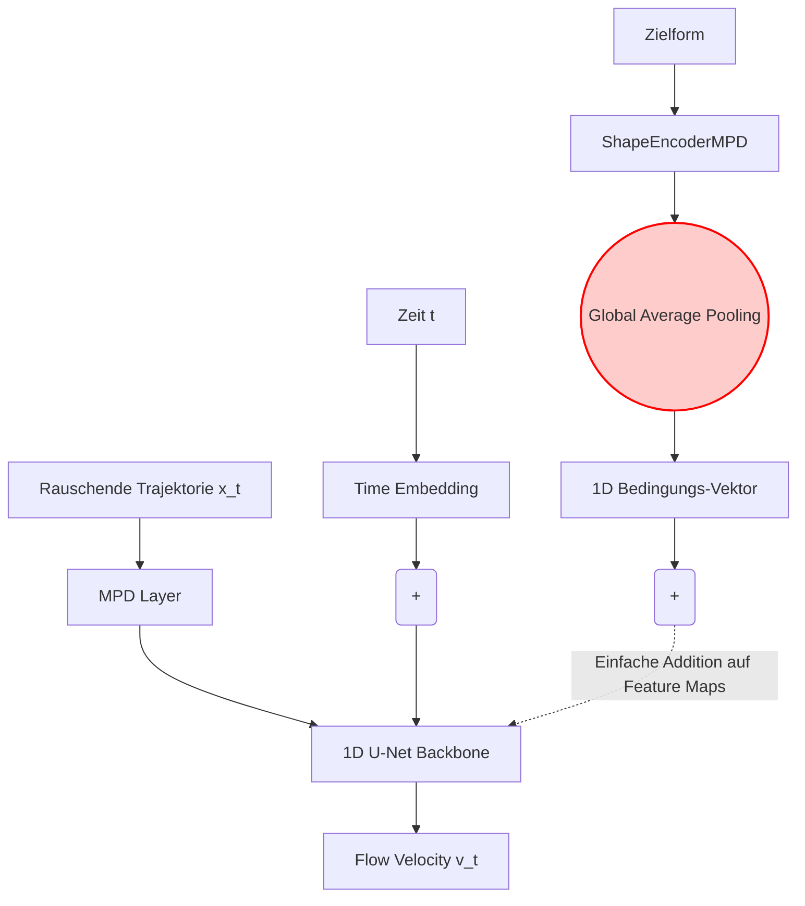
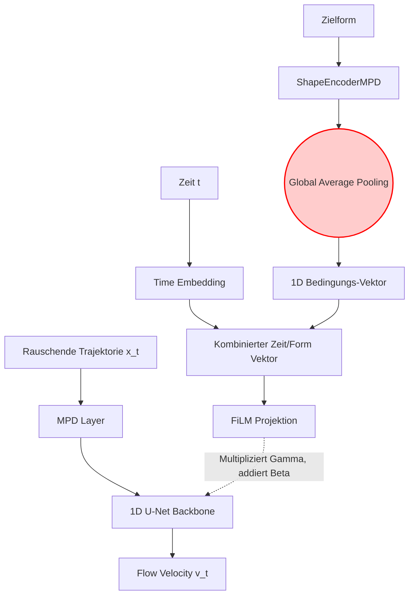
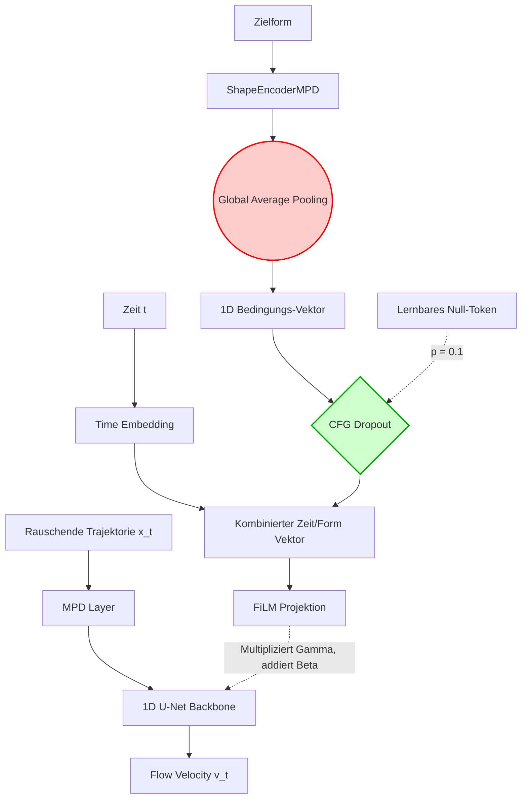
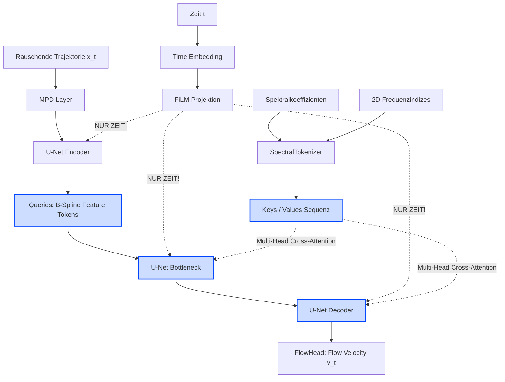

# Architektur-Visualisierungen

Hier sind die Diagramme für alle vier Architektur-Iterationen. Sie verdeutlichen, wie die Konditionierung (die Zielform/Verteilung) verarbeitet und in das U-Net injiziert wird, und wo die entscheidenden Engpässe (GAP) bzw. Innovationen (Cross-Attention) sitzen.

### 1. Baseline: Additive Konditionierung (`_char.py`)
Das einfachste Modell. Die Form wird auf einen Vektor zusammengepresst und einfach addiert.

---

### 2. FiLM Konditionierung (`_char_film.py`)
Ersetzt die einfache Addition durch dynamische Skalierung (Variance) und Verschiebung (Mean) der Feature Maps.

---

### 3. FiLM + Classifier-Free Guidance (`_char_film_cfg.py`)
Fügt den CFG-Dropout hinzu, um das Modell zu zwingen, stärker auf die Konditionierung zu achten, anstatt sie zu ignorieren.

---

### 4. Spectral Cross-Attention (dein aktueller Run)
Ein massiver Umbau. **GAP wird komplett entfernt.** Das Spektrum wird als Sequenz von Tokens erhalten, und das U-Net "schaut" per Attention auf spezifische Frequenzen. (In deinem aktuellen Run sind CFG und die Lambda-Vorhersage deaktiviert).

