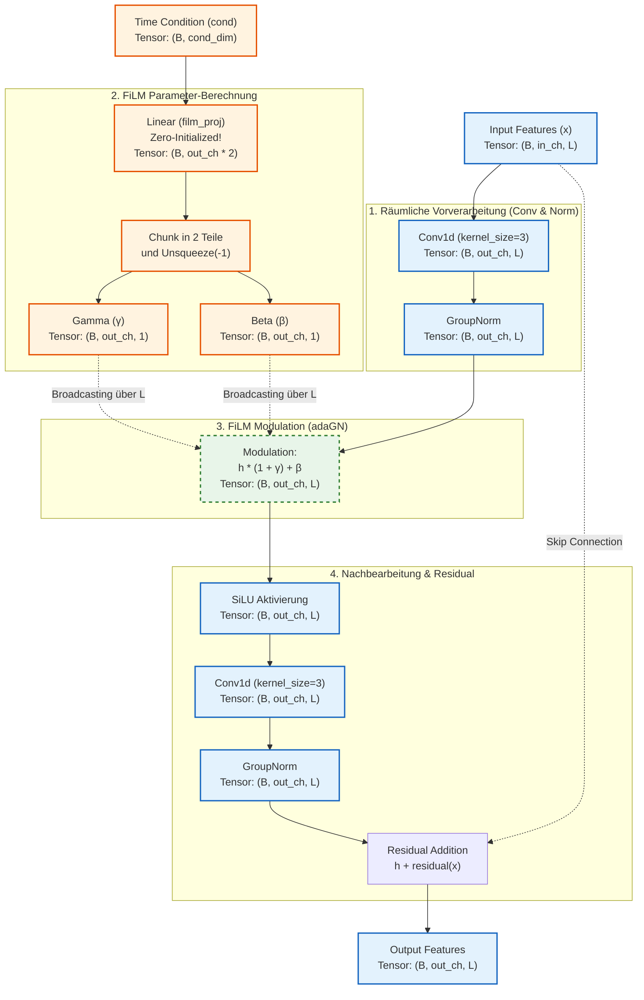

# Datenfluss im ConvResBlock (mit FiLM)

Dieses Diagramm zoomt exakt in deinen `ConvResBlock` (aus `flow_matching_cond_spectral_crossattn.py`) hinein. Es zeigt präzise, wie die räumlichen Trajektorien-Daten und der zeitliche Konditionierungsvektor zusammenfließen, inklusive der Tensor-Dimensionen an jedem Schritt.

Hierbei steht:
- **`B`**: Batch Size
- **`L`**: Sequenzlänge (Anzahl der Wegpunkte, z.B. 20, 10 oder 5)
- **`in_ch`** / **`out_ch`**: Anzahl der Feature-Kanäle (z.B. 128, 256)
- **`cond_dim`**: Größe des Konditionierungsvektors (z.B. 128)

### Die Magie liegt im "Broadcasting" (Schritt 3)
Schau dir die Tensor-Dimensionen von Gamma und Beta an: Sie haben die Form `(B, out_ch, 1)`. 
Die räumlichen Features aus der GroupNorm haben die Form `(B, out_ch, L)`.

Da $\gamma$ und $\beta$ in der räumlichen Dimension (Länge) nur die Größe `1` haben, wendet PyTorch **Broadcasting** an: Der exakt selbe Gamma/Beta-Wert wird auf *alle* `L` Wegpunkte dieses Kanals angewendet! 

Genau das meine ich mit "globalem Stil": FiLM steuert den Kanal als Ganzes über die gesamte Sequenz, anstatt für jeden Wegpunkt einen individuellen Wert zu berechnen (letzteres würde Cross-Attention machen).
