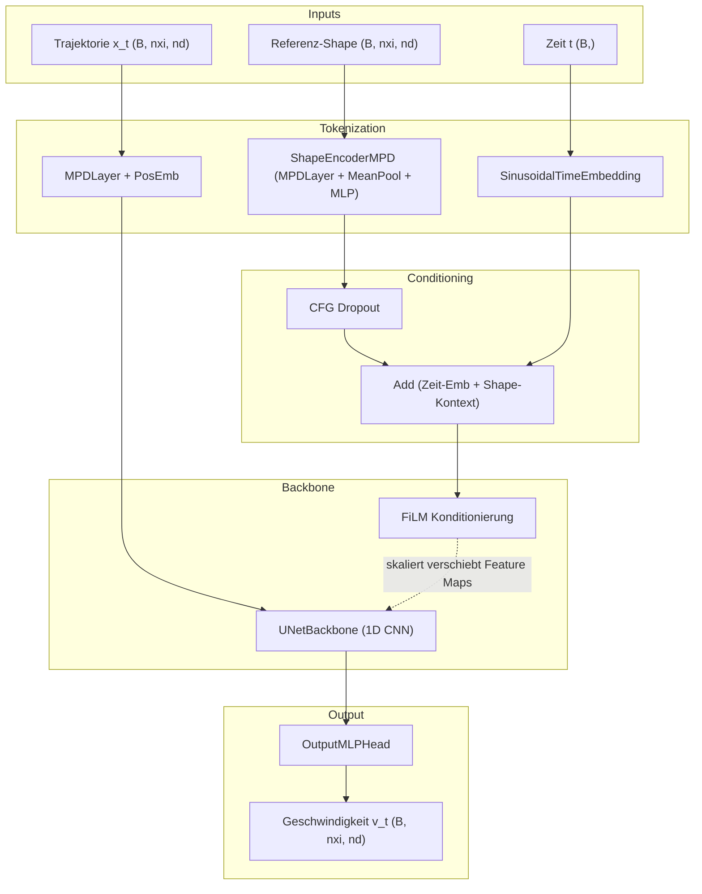
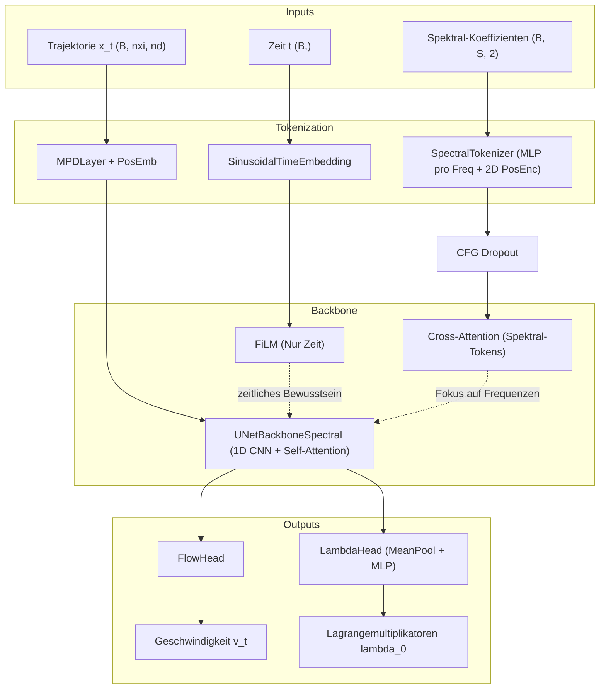
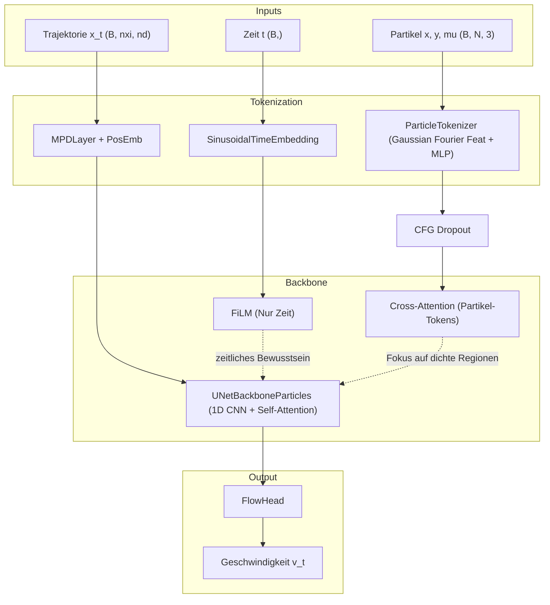
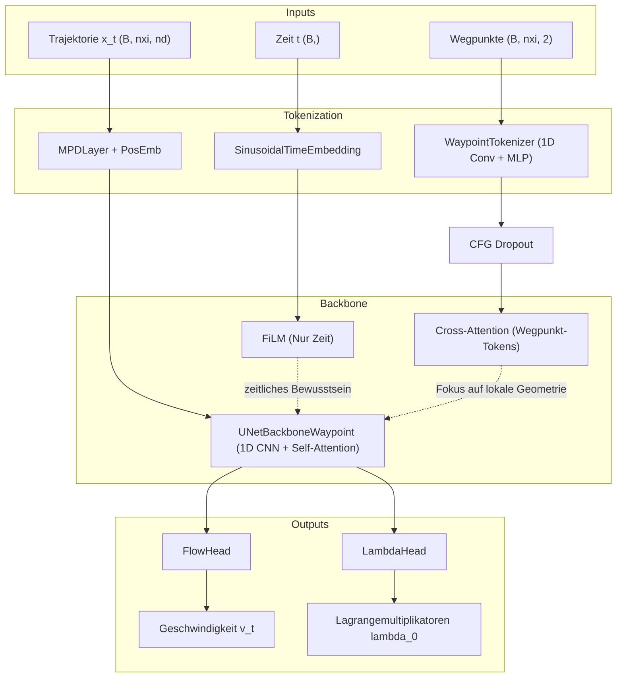
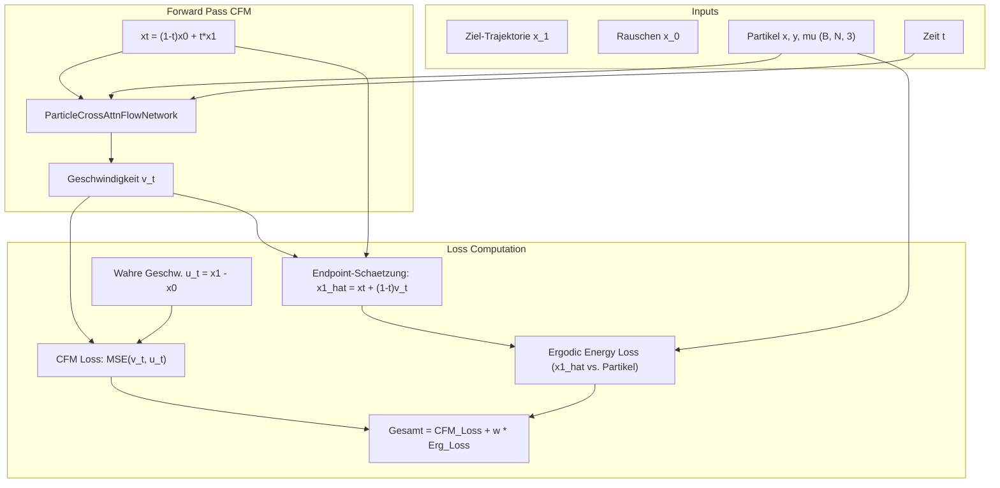
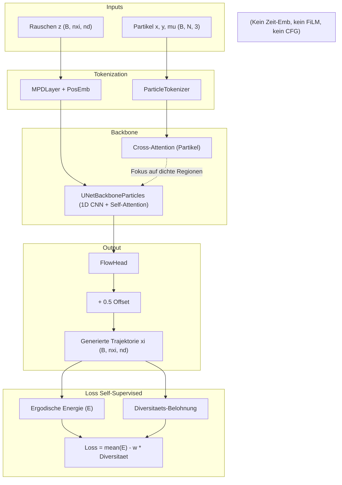

# Architektur-Visualisierungen der Flow-Matching Modelle

Dieses Dokument enthält diagrammatische Visualisierungen der verschiedenen Flow-Matching Architekturen im Projekt. Jede Architektur wurde für unterschiedliche Arten der Konditionierung entwickelt.

Die Entwicklung zeigt einen klaren Trend:
1. **Frühere Ansätze (`_char_film_cfg.py`)**: Nutzen Global Average Pooling (MPD) der Ziel-Shapes und injizieren dies zusammen mit der Zeit über **FiLM** (Feature-wise Linear Modulation) in alle CNN-Blöcke.
2. **Neuere Ansätze (`_spectral`, `_particles`, `_waypoint`)**: Trennen die Zeit- und Form-Konditionierung. Die Zeit wird weiterhin über FiLM injiziert, aber die geometrische/spektrale Konditionierung erfolgt viel ausdrucksstärker über **Cross-Attention** in den Bottleneck- und Decoder-Schichten des U-Nets.
3. **Training mit direkten Metriken**: Neben dem reinen Flow-Matching (CFM) MSE Loss gibt es hybride Ansätze (CFM + Ergodic Loss auf Endpoint-Schätzung) und reine Self-Supervised Ansätze, die direkt gegen die Ergodische Energie optimieren und Flow Matching komplett umgehen.

---

## 1. Baseline: Conditional MPD U-Net (Shape Context via FiLM)
**Datei:** `flow_matching_cond_mpd_unet_char_film_cfg.py`

Diese Architektur bündelt die Zielform in einen einzigen globalen Kontextvektor (mittels Mean Pooling) und injiziert diesen Vektor zusammen mit der Zeit in das gesamte Netzwerk.

---

## 2. Spectral Cross-Attention
**Datei:** `flow_matching_cond_spectral_crossattn.py`

Diese Architektur nutzt Cross-Attention, um das Modell selektiv auf verschiedene Ergodische Frequenzen (Spektral-Koeffizienten) achten zu lassen. Zudem sagt sie Lagrangemultiplikatoren voraus.

---

## 3. Particle Cross-Attention (Standard Training)
**Datei:** `flow_matching_cond_particles_crossattn.py`

Diese Architektur verwendet eine dichte Punktwolke (Partikel mit Dichte mu) als Konditionierung. Sie verwendet Gaussian Fourier Features, um Spectral Bias bei den geometrischen Koordinaten zu verhindern.

---

## 4. Waypoint Cross-Attention
**Datei:** `flow_matching_cond_waypoint_crossattn.py`

Hier werden Wegpunkte direkt als Tokens verarbeitet (durch 1D Convolutions auf den Koordinaten), um lokale geometrische Zusammenhänge zu lernen. Auch hier werden Lagrangemultiplikatoren vorhergesagt.

---

## 5. Flow-Matching mit Ergodischer Metrik im Loss
**Datei:** `flow_matching_cond_particles_crossattn.py` (`compute_particle_cfm_loss`)

Hierbei handelt es sich um eine abweichende Trainings- und Loss-Strategie, nicht um eine modifizierte Modell-Architektur. Das Modell ist das `ParticleCrossAttnFlowNetwork`. Die vorhergesagte Geschwindigkeit v_t wird verwendet, um den Endpunkt der Trajektorie x_1 zu schätzen. Auf diese Schätzung wird die Ergodische Metrik angewandt.

---

## 6. Self-Supervised Particle Generator
**Datei:** `flow_matching_particles_selfsupervised.py`

Dieser Ansatz bricht mit dem iterativen Flow-Matching Konzept und nutzt das modifizierte `UNetBackboneParticles` als Single-Pass Generator. Rauschen (z) nimmt die Rolle der initialen Sequenz ein. Das Netzwerk hat keine Zeit-Eingabe (FiLM ist inaktiviert) und kein CFG (Classifier-Free Guidance). Das Output-Modell projiziert (Rauschen + Partikel-Kontext) direkt auf generierte B-Spline Kontrollpunkte.

